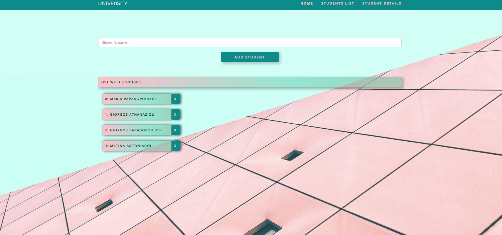
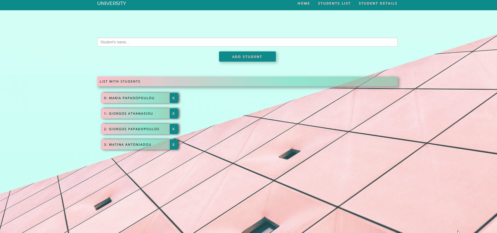
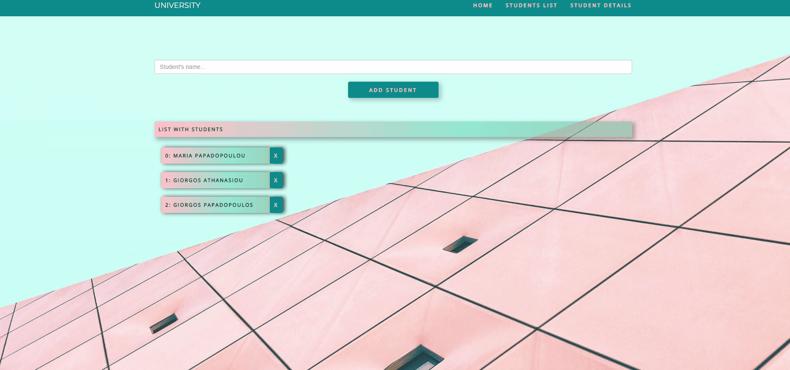

# University Project

This project was generated with [Angular CLI](https://github.com/angular/angular-cli) version 12.2.7.

## Development server

- Clone repository 
- Run `npm install` 
- Run `ng serve` for a dev server
- Navigate to `http://localhost:4200/`. The app will automatically reload if you change any of the source files.

## Description

This project is about **adding** and **deleting students to a list**. 
More specifically, the **basic features** are the following:

### Creation of a nav-bar with corresponding routing

 

### Creation of **3 components** which are related to every tab of the nav-bar

#### Student Component:
It refers to **Home Page** in which we can *add a new student to a list and then display it*. Furthermore,
in this page we can *delete a specific student or even route to a student's details*.
By adding and deleting a student, user is being informed by getting a *notification* which was created via 
bootstrap toaster.  
    
 
    
#### Students-List Component
It refers to **Students List Page** in which *list is being displayed*. Also, in this page we can 
can *delete a specific student or even route to a student's details* as we explained in the previous component.
    
 
     
#### Students-Details Component:
It refers to **Student Details Page** in which *student's details are being displayed*. 
    
 
    
Features such us: *getting students list, deleting a student and getting student's details was created into a service*.
