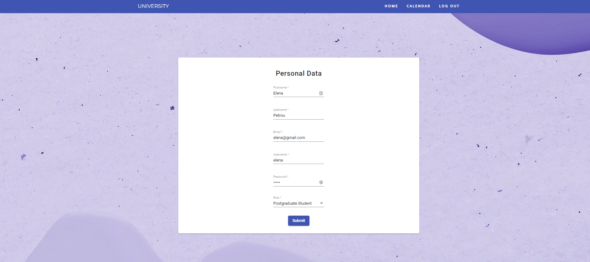
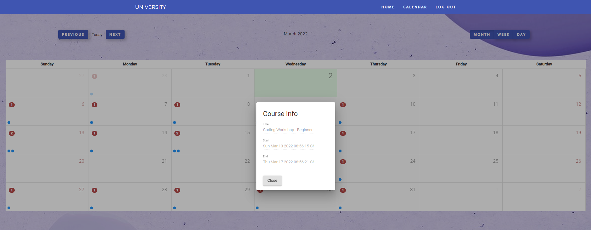
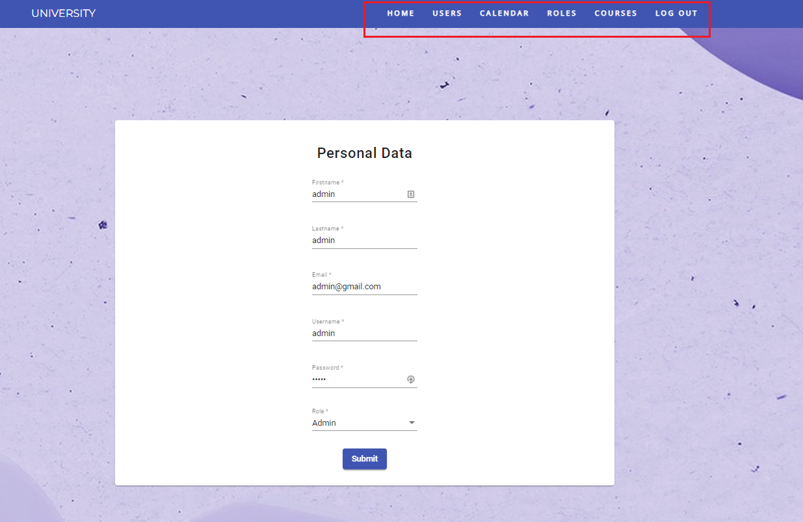
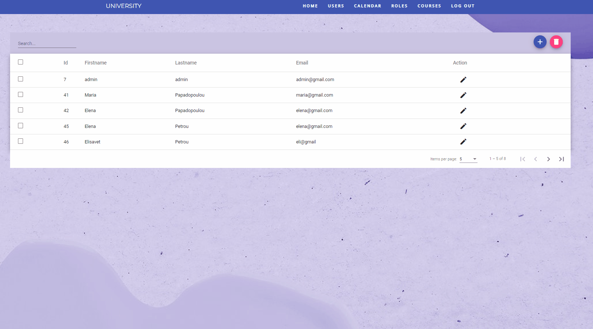
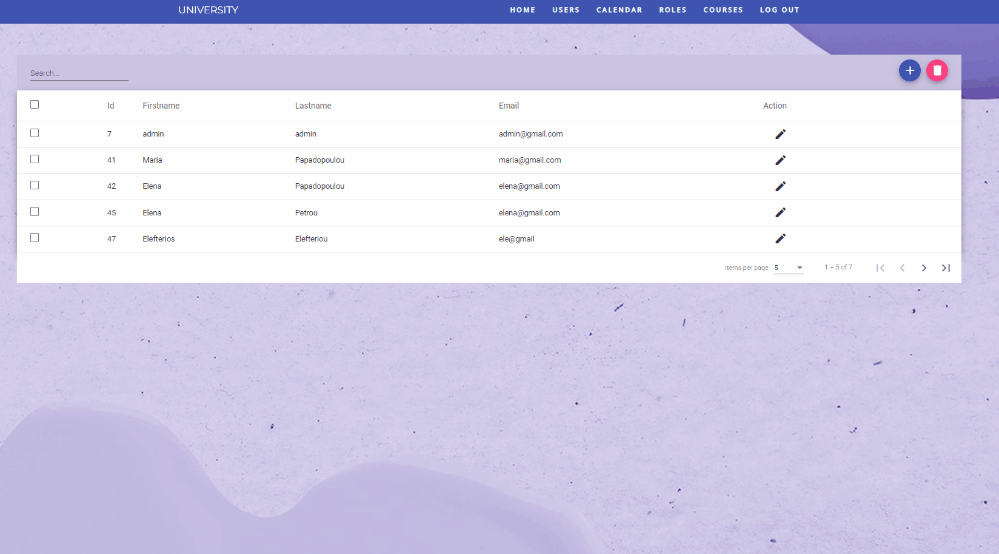
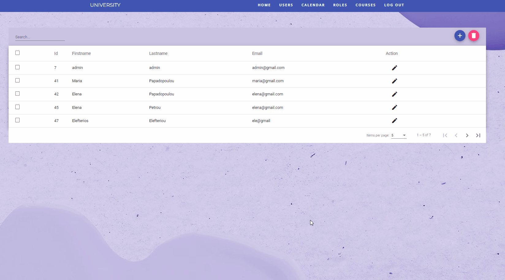
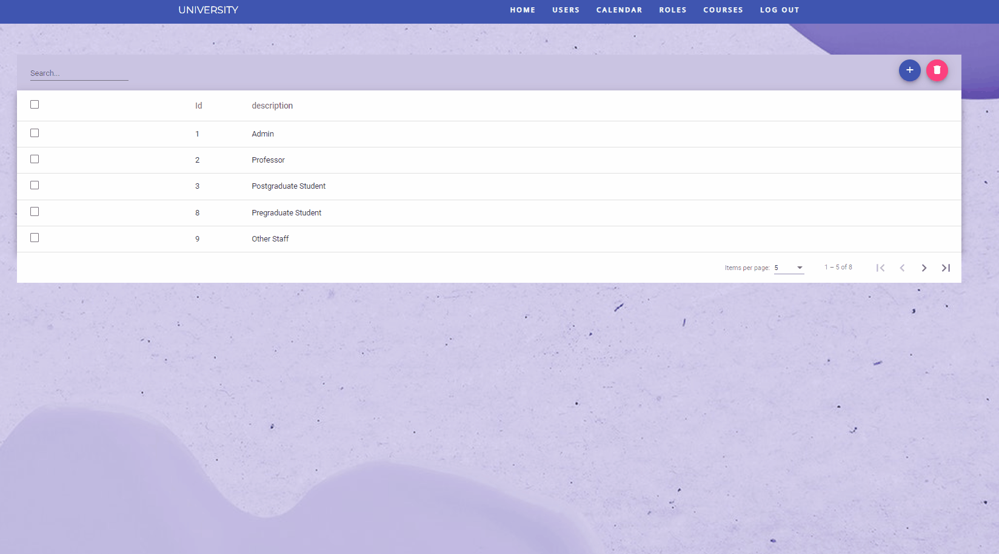
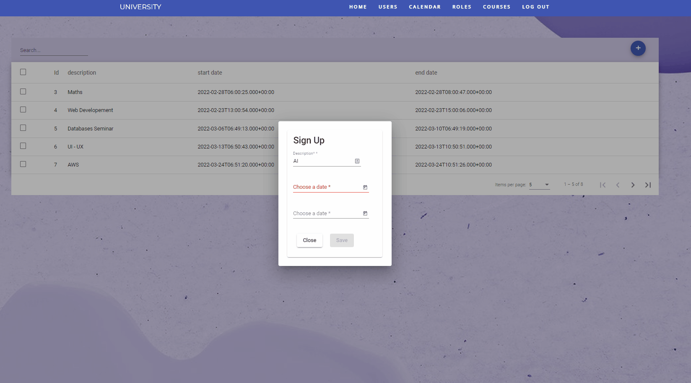
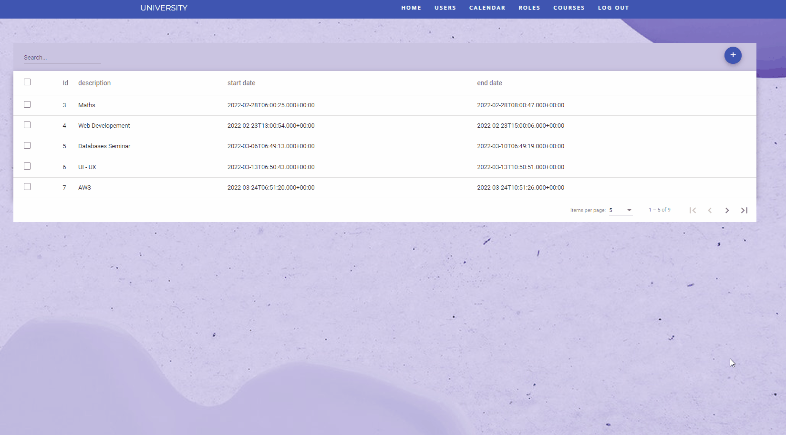

# University Project

This project was generated with [Angular CLI](https://github.com/angular/angular-cli) version 12.2.7.

## Development server

- Clone repository 
- Run `npm install` 
- Run `ng serve` for a dev server
- Navigate to `http://localhost:4200/`. The app will automatically reload if you change any of the source files.

## Description

This project is frontend part of an app related to a university. You will find the backend part [here](https://github.com/LeniwPetrou/university-backend) 
More specifically, the **basic features** are the following:

### Log in 
- Log in page with **complete authentication**. If username and password are not filled or authentication has failed, user is being informed by related messages (snackbars).

 

### Sign up
- Sign up page in order to add a new user. Submit button is disabled at the beginning because there are validations related to required fields. As soon as user fills all the required fields then the submit button is being enabled.

### Nav-bar
- Nav bar and menu **changes related to connected user**. Admin has more privileges and he can take control of more features in app.

#### Other Users
##### Home Page
- In this page users can **edit their personal data**. 

 

##### Calendar Page
- In this page users can **see some events or courses** which have been added by admin. 

 

#### Admin
##### Home Page
- Admin has also the right to **edit his personal data**.

 

##### Users Page
- In this page, admin can **add, edit or delete a user**. If there is **no selected user then a related message is shown**. Also, **admin can search for a certain user by filtering the data**. The data are being displayed with **pagination**.

###### - Add

###### - Delete

###### - Edit

###### - Search

##### Roles Page

- In this page, admin has the right to **add, delete and search for a role**. Also, features, such as search, pagination or no selected role message, that have been described in the previous page are applied in this one too.

##### Courses Page

- In this page admin can add some events or courses that afterwards are being displayed on the calendar. When admin adds an event he can **pick not only a date but also an hour too**.  

### Log out

- Users can **log out and the app redirects to the log in page**.

    
