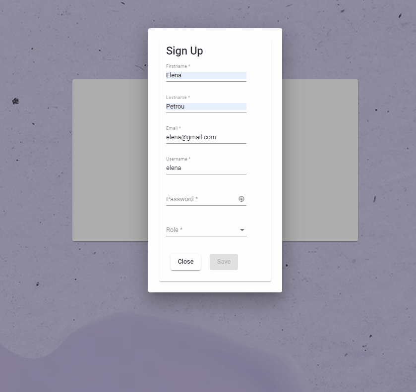

# University Project

This project was generated with [Angular CLI](https://github.com/angular/angular-cli) version 12.2.7.

## Development server

- Clone repository 
- Run `npm install` 
- Run `ng serve` for a dev server
- Navigate to `http://localhost:4200/`. The app will automatically reload if you change any of the source files.

## Description

This project is frontent part of an app related to a university. 
More specifically, the **basic features** are the following:

### Log in 
Log in page with complete authentication. If username and password are not filled or authentication has failed, user is being informed by related messages (snackbars).

 

### Sign up
Sign up page in order to add a new user. Submit button is disabled at the beginning because there are validations related to required fields. As soon as user fills all the required fields then the submit button is being enabled.

### Nav-bar
Nav bar changes related to connected user. Admin has more privileges and he can take control of more features in app.

 

#### Other Users
##### Home 
In this page users can edit their personal data 

##### Calendar 
In this page users can see some events or courses which have been added by admin 

 

#### Admin
##### Students List
Admin can add, edit or delete a user. If there is no selected user then a related message is shown. Also, admin can search for a certain user by filtering the data.
    
